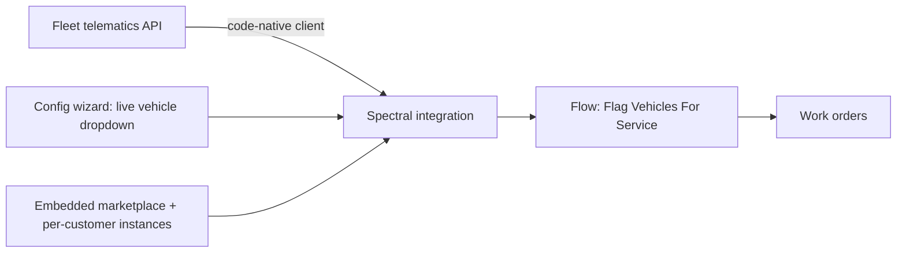

# Acme FSM × Prismatic

**The same fleet-telematics problem, two futures — with a real working integration in between.**

A sales-engineering leave-behind for *Acme FSM*: a code-native Prismatic integration that turns Acme's fleet-telematics feed into service work orders, plus an interactive look at what changes when Acme builds *with* Prismatic instead of by hand.

| 🔎 [Interactive demo](https://smeltser-dev.github.io/acme-x-prismatic/) | ▶️ [2-min walkthrough](#) | 💻 [Integration code](./integration) |
|---|---|---|

---

## Three layers

1. **The buyer story** — with vs. without Prismatic (this page + the demo).
2. **The interactive demo** — [`/docs`](https://smeltser-dev.github.io/acme-x-prismatic/), a single-page walk-through with a `?with` / `?without` toggle.
3. **A real Prismatic Spectral integration** — [`/integration`](./integration), code-native TypeScript you can read, test, and import.

## The problem, in Acme's words

Acme FSM runs field service for HVAC / plumbing / electrical contractors. Their fleet telematics lives behind a **custom API with no off-the-shelf connector**. Today an engineer owns every integration by hand, ~30% of engineering capacity goes to one-offs, and their own customers increasingly want to self-serve. They're starting to lose deals to a richer integration story.

## Without vs. With Prismatic

| | Without Prismatic | With Prismatic |
|---|---|---|
| First integration live | 6–10 weeks of custom build | days |
| Who owns each connector | Acme engineering, every time | Acme productizes once; customers self-serve |
| The "weird" sources (SOAP / telematics) | bespoke, fragile | code-native SDK fills the gap |
| Customer config | support tickets / hardcoded | embedded marketplace + config wizard |
| Scaling to 1,000 customers | backlog + variance | reusable integration, per-customer instances |

> Acme still owns the product opinion. Prismatic removes the undifferentiated integration substrate.

## The real integration

[`/integration`](./integration) is a **code-native Spectral (TypeScript)** integration:

- Wraps a fleet-telematics feed — a custom source with **no pre-built connector**.
- A **config wizard** whose vehicle dropdown **live-fetches the customer's own data**.
- A flow, **Flag Vehicles For Service**, that raises a work order for any vehicle past its service interval or reporting a fault code.
- Runs on Prismatic's managed runtime with full execution logs. Tested green; imported to a live trial.

Example run: **5 vehicles scanned → 2 work orders** (one 240h over interval + fault `P0420`, one 222h over).

## Architecture



## Customer stories that informed this demo

Real Prismatic customers with the same shape of problem (figures as published by Prismatic):

- **[STRMS](https://prismatic.io/customers/strms/)** — 80% less integration maintenance, 50% more customers.
- **[Duro Labs](https://prismatic.io/customers/duro-labs/)** — 10× faster builds; customers self-activate, engineers freed.
- **[Karbon](https://prismatic.io/customers/karbon/)** — 75+ integrations in a year, 80% less dev time.

## Run / inspect locally

```bash
cd integration
npm install
npm test                 # runs the flow against the mock telematics API
npx prism login          # to import into your own Prismatic org
npm run import
```

The mock API is backed by [`db.json`](./db.json) (served via my-json-server). If the public endpoint is unavailable, run it locally: `npx json-server db.json`.
